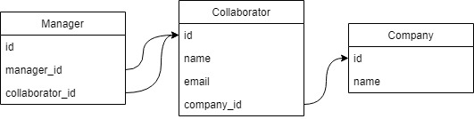

# Qulture Back-End Challenge
Back-End Challenge from Qulture.rocks Documention. The application is coded entirely in Python3. 

## Requirements
- Python 3
- Pip

## Running the app

### For Windows
Create a virtual enviorment and activate it:
```
python3 -m venv ./venv 
```
```
.\venv\Scripts\activate
```
Install the requirements:
```
pip install -r .\requirements.txt
```
Run application on your local machine by running the command:
```
python3 server.py
```

## Database Documentation
The database diagram:\


## API Documentation
There is a Postman collection with sample API calls and some simple tests. Import it with this link:
https://www.getpostman.com/collections/4ad7d24e8bb44b995b6e

All the links are refered to port 5000. But your application might run in another port.

### Company

**Retrive all companies** \
`GET` http://127.0.0.1:5000/companies


**Create new company** \
`POST` http://127.0.0.1:5000/company \
Parameters: \
&nbsp;&nbsp;&nbsp;&nbsp;name

**Retrive data from one company** \
`GET` http://127.0.0.1:5000/company/<company_id>

### Collaborator

**Retrive all collaborators** \
`GET` http://127.0.0.1:5000/collaborators

**Create new collaborator** \
`POST`http://127.0.0.1:5000/collaborator \
Parameters: \
&nbsp;&nbsp;&nbsp;&nbsp;name \
&nbsp;&nbsp;&nbsp;&nbsp;email \
&nbsp;&nbsp;&nbsp;&nbsp;company_id

**Retrive data from one collaborator** \
`GET` http://127.0.0.1:5000/collaborator/<collaborator_id>

**Delete one collaborator** \
`DELETE` http://127.0.0.1:5000/collaborator/<collaborator_id>

### Company-Collaborator

**Retrive collaborators from one company** \
`GET` http://127.0.0.1:5000/company/<comany_id>/collaborators

**Register a collaborator to a company** \
`PUT`http://127.0.0.1:5000/company/<comany_id>/collaborator/<collaborator_id>

**Delete one from a company** \
`DELETE` http://127.0.0.1:5000/company/1/collaborator/1

### Manager

**Create new relation between manager and collaborator** \
`POST`http://127.0.0.1:5000/manager/<manager_id>/collaborator/<collaborator_id>

**Retrive collaborators of a manager** \
`GET` http://127.0.0.1:5000/manager/<manager_id>/collaborators

**Retrive second level collaborators of a manager** \
`GET` http://127.0.0.1:5000/manager/<manager_id>/managers/collaborators

**Retrive second level collaborators of a manager** \
`GET` http://127.0.0.1:5000/collaborator/<collaborator_id>/team

